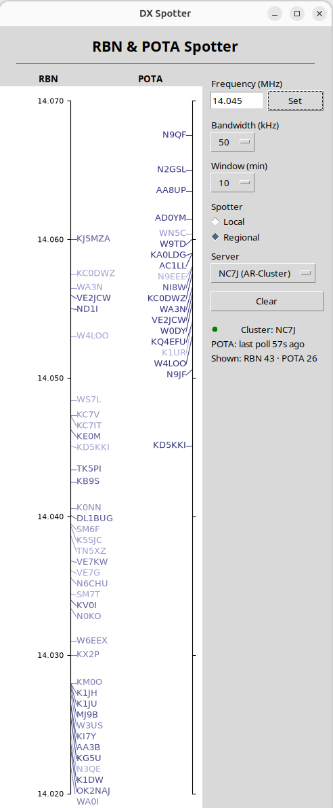

# The Spec Is the New Schematic

<h1><a href="slides/rsgb-sdd-n6yu-presentation.pdf">&#128196; RSGB Convention &ldquo;The Spec Is the New Schematic&rdquo; Presentation</a></h1>

<h3><a href="slides/rsgb-sdd-n6yu-presentation.pdf">Open the slides (PDF)</a> &nbsp;&middot;&nbsp; <a href="https://github.com/jcarter-labs/rsgb-sdd-n6yu/raw/main/slides/rsgb-sdd-n6yu-presentation.pdf">Download the PDF</a></h3>

---

**Reproducible Station Software with Spec-Driven Development (SDD)**
RSGB Convention 2026 (9–11 October) · John Carter, N6YU

Spec-Driven Development (SDD) means you write down what a piece of software must do, in plain language with testable numbers, and have an AI coding assistant build it from that document. The spec plays the role the schematic plays in a hardware project: when the build is wrong, you fix the spec, not the output.

*Click the diagram for the full-size image.*

## Start here

**Your first masterplan starts here: [`masterplan/masterplan-generator.md`](masterplan/masterplan-generator.md).**
Give it to Claude Code with a short description of your app idea and a screenshot of something close to what you want. It interviews you and writes a masterplan; you then build from that masterplan one tested step at a time.

## The worked example: DX Spotter

A CW bandmap of RBN and POTA spots, built from a short idea file and one screenshot.

<table>
  <tr>
    <td align="center"> <b>Input:</b> reference look (Linux)</td>
    <td>&nbsp;&nbsp;&nbsp;&nbsp;&nbsp;&nbsp;&nbsp;</td>
    <td align="center"> <b>Result:</b> the app as built (macOS)</td>
  </tr>
</table>

Everything about the build is in [github.com/jcarter-labs/dx-spotter-app](https://github.com/jcarter-labs/dx-spotter-app): the idea file ([`idea.md`](https://github.com/jcarter-labs/dx-spotter-app/blob/main/idea.md)), the example masterplan the generator produced ([`masterplan.md`](https://github.com/jcarter-labs/dx-spotter-app/blob/main/masterplan.md)), the code, the tests and the full commit history.

## What's here

| Path | What it is |
|---|---|
| [`slides/rsgb-sdd-n6yu-presentation.pdf`](slides/rsgb-sdd-n6yu-presentation.pdf) | The talk's slides as a PDF (19 pages, clickable links) |
| [`masterplan/masterplan-generator.md`](masterplan/masterplan-generator.md) | Give this to Claude Code. It interviews you and writes a masterplan for your own app. |
| [`docs/rsgb-sdd-n6yu-flow.png`](docs/rsgb-sdd-n6yu-flow.png) | The SDD flow diagram above, full size |
| [`docs/dx-spotter-reference.png`](docs/dx-spotter-reference.png) | The example's input: the reference look the masterplan describes |
| [`docs/dx-spotter-result.png`](docs/dx-spotter-result.png) | The example's result: DX Spotter as built |
| [`docs/rsgb-sdd-n6yu-idea-raw-prompt.md`](docs/rsgb-sdd-n6yu-idea-raw-prompt.md) | The example's raw prompt: my first words, as typed, before the interview turned them into the idea file |
| [`docs/rsgb-sdd-n6yu-idea.md`](docs/rsgb-sdd-n6yu-idea.md) | The example's idea file: the app brief the masterplan generator started from |
| [`docs/rsgb-sdd-n6yu-faqs.pdf`](docs/rsgb-sdd-n6yu-faqs.pdf) | Handout: FAQs for applying SDD to building, porting and extending open-source and published projects |
| [`docs/rsgb-sdd-n6yu-references.md`](docs/rsgb-sdd-n6yu-references.md) | Papers, courses and projects cited in the talk |

## Rights

© 2026 John Carter (N6YU). Free to use and adapt for personal, non-commercial projects; attribution appreciated. Talk materials were prepared for RSGB Convention 2026; contact [john@n6yu.com](mailto:john@n6yu.com) for other uses.
